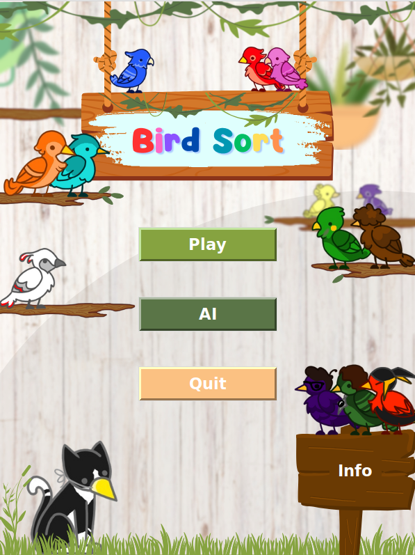
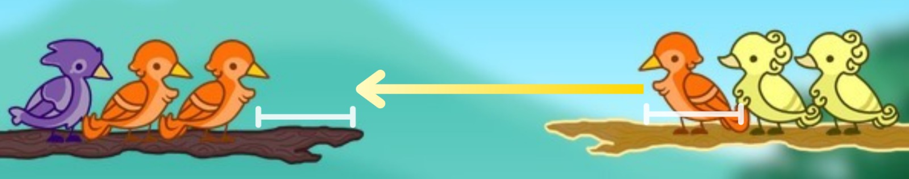
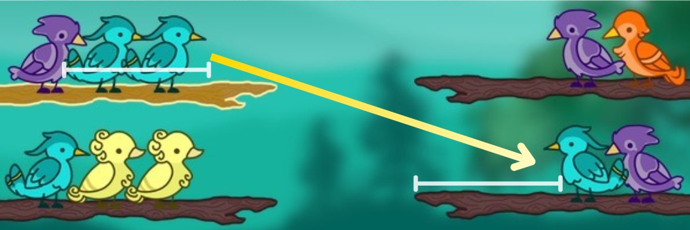
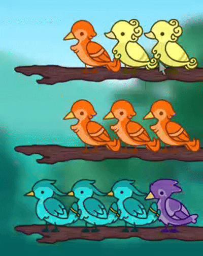
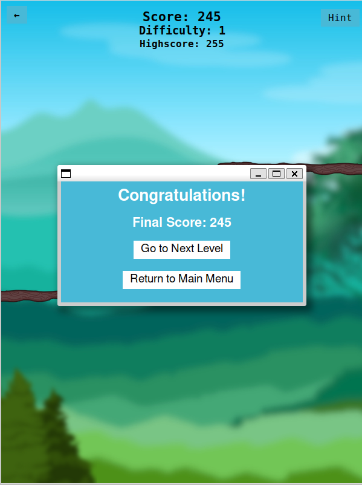

# Bird Sort - Color Puzzle
## Group A1-88
33.3% - up202208429 Luís Martim \
33.3% - up202208511 Tiago Teixeira \
33.3% - up202300600 Yuka Sakai

## Game Description
Bird Sort is a single-player puzzle game inspired by color sorting mechanics. Your objective is to sort birds of the same color into individual branches by moving them one at a time, following a set of simple rules. The game challenges your logical thinking and strategic planning as the difficulty gradually increases with each level. 

   
  <em>Figure 1: Main Menu</em>

## Rules
In order to solve the color puzzle, we defined a set of rules for you to follow and understand before you start playing!

### Branch Space:
Each branch can hold up to 4 birds. If all birds in a branch are of the same color, that color along with this branch are removed from the puzzle.

### Moving a Bird:
To move a bird from one branch to another:
- The **destination branch** must either be **empty** or have **enough space**.
- If not empty, the **top bird** on the destination branch must be the **same color** as the bird being moved.

   
  <em>Figure 2: Moving a single bird</em>

### Moving a Group of Birds:
This rule follows the same principles as above, with one addition:
- Birds of the **same color**, if **stacked together**, **must move together** as a group.
- The destination must be either empty or have **enough space for the entire group**.

   
  <em>Figure 3: Moving a group of birds</em>

### Forming a Sequence:
- Once **4 birds of the same color** are placed on the same branch, that branch **breaks**, increasing the player’s score.
- As mentioned in the first rule, both the **branch** and the **birds** are removed from the puzzle.

   
  <em>Figure 4: Breaking a branch with 4 same-colored birds</em>

### Level Completion
A level is completed when all branches have been cleared by correctly grouping and removing all birds of the same color. Once done, you'll be presented with options to either move to the next puzzle or return to the main menu.

   
  <em>Figure 5: Options displayed after finishing a level</em>

## Setup and Execution
Before running the game, ensure your environment is properly configured. Follow the steps below to install the necessary tools and dependencies.

### Requirements:

- **Python 3.10 or higher**  
  - Download it from the [official Python website](https://www.python.org/downloads/)

- **Dependencies**  
  - Install the required Python packages with pip: `pip install pillow`.

### Execution
To execute the game, navigate to **/code** and simply run `python3 main_menu.py`. 

## Features

- **Interactive Gameplay**
  - Move birds between branches based on simple, intuitive rules.
  - Group movements are enforced when birds of the same color are stacked.
  - Highlighted branches help track the currently selected branch.

- **Color-Matching Puzzle Mechanics**
  - Match four birds of the same color to break a branch and score points.
  - Requires strategic thinking to avoid deadlocks and optimize move efficiency.

- **Hints System**
  - Get assistance when you're stuck with a built-in hint system.
  - Highlights a possible valid move to help you progress without giving away the entire solution.

- **Score System**
  - Points are awarded for every successfully completed sequence.
  - Progress is tracked in Human Mode to encourage high-score chasing and replayability.

- **Visual Feedback**
  - Smooth animations and clear indicators for valid and invalid actions.
  - Distinct visual design for birds, branches, and UI elements.

- **Rule-Based Logic**
  - Strictly defined mechanics ensure fairness and consistent gameplay behavior.
  - Puzzle logic is transparent, making the game feel intuitive yet strategic.

- **Replayability**
  - Random puzzle generation guarantees a unique experience every time you play.

- **Challenging Yet Accessible**
  - Easy to learn, difficult to master — with increasing complexity at higher levels.

### AI Features

- **Multiple Algorithms**
  - Includes a variety of AI approaches to solve puzzles (DFS, BFS, A*, and more!)

- **Game State Control**
  - Supports puzzle generation by difficulty level or direct loading from `.txt` files.
  - Ideal for testing, benchmarking, or replaying specific puzzle states.

- **Statistics Display**
  - Tracks AI performance metrics such as number of moves, search depth, and execution time.
  - Helpful for comparing and analyzing algorithm efficiency.

- **Step-by-Step Visualization**
  - AI moves are displayed one by one, allowing players to follow the decision-making process.
  - Great for debugging or learning how the AI thinks.

## Game Navigation

## Code

## Results

## Art
